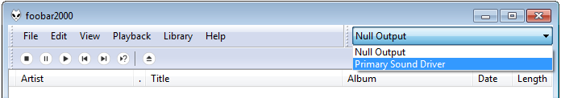
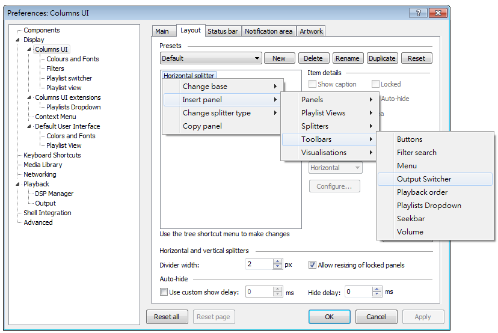
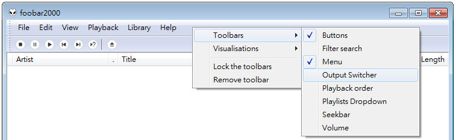

# foo_uie_output_switcher 

### Features
* A dropdown combobox for changing output device quickly 

### Download
[Releases page](../../releases)

### Usage
* Install [foo_ui_columns](https://www.foobar2000.org/components/view/foo_ui_columns) plugin
* To add `foo_uie_output_switcher`, right-click in Preferences, ColumnsUI layout: 
* Or right-click on menu bar: 

**If the plugin goes out-of-sync with the preferences, try click anywhere else on screen and then reopen the dropdown list, this force the plugin to reload**

### Compiler
* Visual Studio 2017 Community

### License
See [LICENSE](./LICENSE) file

### Third-party code
* [foobar2000 Software Development Kit](https://www.foobar2000.org/SDK)
* [Columns UI SDK](https://github.com/reupen/columns_ui)
